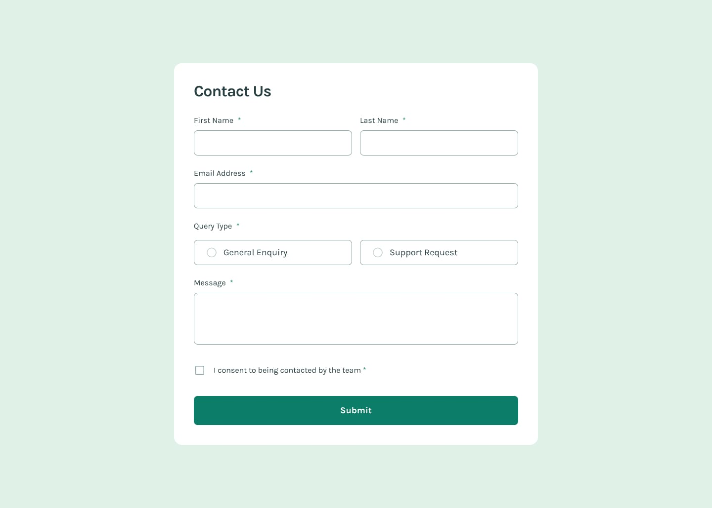

# Frontend Mentor - Contact form solution

This is a solution to the [Contact form challenge on Frontend Mentor](https://www.frontendmentor.io/challenges/contact-form--G-hYlqKJj). Frontend Mentor challenges help you improve your coding skills by building realistic projects.

## Features

- Built with React
- Styled with pure CSS
- Basic form validations
- Success popup on form submission

## Links

[Solution URL here][repository] | [Preview form here][netlify]

[repository]: https://github.com/Abgmz/fm-contact-form
[netlify]: https://fm-contact-form.netlify.app
